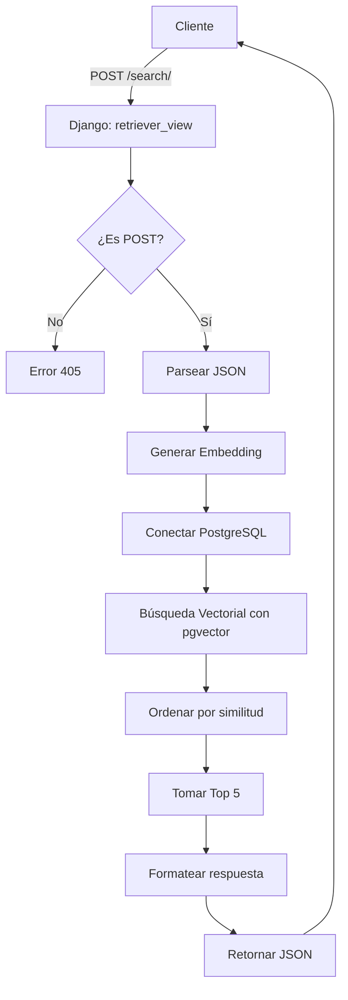

# VectorStore Retriever Service

## 📋 Descripción del Proyecto

**VectorStoreService** es un servicio de recuperación semántica (Semantic Search/Retrieval) construido con Django que implementa búsqueda vectorial usando embeddings de modelos de lenguaje. El proyecto permite encontrar fragmentos de texto relevantes basándose en similitud semántica, no en coincidencias exactas de palabras clave.

Este tipo de sistema es fundamental para arquitecturas **RAG (Retrieval-Augmented Generation)**, donde se recupera contexto relevante antes de generar respuestas con modelos de lenguaje.

### 🎯 Caso de Uso Principal

Permite realizar búsquedas inteligentes en una base de datos de contenido educativo (temarios de academia), donde:
- El usuario envía una consulta en lenguaje natural
- El sistema encuentra los 5 fragmentos más relevantes semánticamente
- Retorna los fragmentos con sus metadatos (URL, ID, puntuación de similitud)

---

## 🏗️ Arquitectura del Proyecto

### Estructura de Directorios

```
VectorStoreService/
│
├── manage.py                      # CLI de Django
├── Pipfile                        # Dependencias del proyecto (pipenv)
├── README.md                      # Este archivo
│
├── VectorStore_Project/           # Configuración principal del proyecto Django
│   ├── __init__.py
│   ├── settings.py                # Configuración de Django
│   ├── urls.py                    # URLs principales del proyecto
│   ├── wsgi.py                    # Punto de entrada WSGI
│   └── asgi.py                    # Punto de entrada ASGI
│
└── apps/
    └── VectorStore_Retriever/     # App principal de búsqueda vectorial
        ├── __init__.py
        ├── admin.py               # Configuración del admin de Django
        ├── apps.py                # Configuración de la app
        ├── models.py              # Modelos de datos (si los hay)
        ├── tests.py               # Tests unitarios
        ├── urls.py                # URLs de la app
        ├── views.py               # ⭐ Vista principal del retriever
        └── migrations/            # Migraciones de base de datos
            └── __init__.py
```

### Tecnologías Utilizadas

| Tecnología | Versión | Propósito |
|-----------|---------|-----------|
| **Python** | 3.13 | Lenguaje base |
| **Django** | 6.0+ | Framework web |
| **LangChain** | Latest | Orquestación de LLMs y embeddings |
| **HuggingFace** | Latest | Modelos de embeddings |
| **Sentence Transformers** | Latest | Modelo multilingüe de embeddings |
| **PostgreSQL + pgvector** | - | Base de datos vectorial |
| **psycopg2-binary** | Latest | Conector PostgreSQL |

---

## 🧠 Funcionamiento Detallado de la Vista Principal

### Archivo: `apps/VectorStore_Retriever/views.py`

Esta vista implementa el corazón del sistema de búsqueda semántica. A continuación se explica cada componente en detalle:

### 1️⃣ Inicialización del Modelo de Embeddings

```python
embeddings_model = HuggingFaceEmbeddings(
    model_name="sentence-transformers/paraphrase-multilingual-MiniLM-L12-v2"
)
```

**¿Qué hace?**
- Carga un modelo de **Sentence Transformers** de HuggingFace
- Este modelo convierte texto en vectores numéricos (embeddings) de **384 dimensiones**
- El modelo es **multilingüe**: funciona con español, inglés, portugués, etc.
- Captura el **significado semántico** del texto, no solo palabras clave

**¿Por qué este modelo?**
- `paraphrase-multilingual-MiniLM-L12-v2` está optimizado para:
  - Búsqueda semántica
  - Parafraseo (detecta que "auto" y "coche" son similares)
  - Tamaño compacto (rápido y eficiente)

**Ejemplo de embedding:**
```python
texto = "¿Qué es la inteligencia artificial?"
embedding = [0.023, -0.145, 0.567, ..., 0.234]  # 384 números
```

---

### 2️⃣ Vista `retriever_view`

#### Función Principal

```python
@csrf_exempt
def retriever_view(request):
```

**Decorador `@csrf_exempt`:**
- Desactiva la protección CSRF (Cross-Site Request Forgery)
- Necesario para APIs que reciben peticiones de otros dominios
- ⚠️ **En producción**: Implementar autenticación adecuada (JWT, API Keys)

---

#### Flujo de Ejecución Paso a Paso

##### **PASO 1: Validación del Método HTTP**

```python
if request.method == 'POST':
    # ... lógica principal
else:
    return JsonResponse({"status": "only_post_allowed"}, status=405)
```

- Solo acepta peticiones **POST**
- Cualquier otro método (GET, PUT, DELETE) retorna error **405 Method Not Allowed**

---

##### **PASO 2: Parseo de Datos de Entrada**

```python
data = json.loads(request.body)
resumen_busqueda = data.get('resumen_busqueda', '')
```

**Formato esperado de la petición:**
```json
POST /search/
Content-Type: application/json

{
  "resumen_busqueda": "¿Cómo funciona la fotosíntesis en las plantas?"
}
```

- Extrae el campo `resumen_busqueda`: la consulta del usuario en lenguaje natural
- Si no existe, usa string vacío como default

---

##### **PASO 3: Generación del Embedding de la Consulta**

```python
query_embedding = embeddings_model.embed_query(resumen_busqueda)
```

**¿Qué sucede aquí?**

1. El texto de la consulta se pasa al modelo de embeddings
2. El modelo analiza el significado semántico
3. Retorna un vector de 384 números flotantes

**Ejemplo:**
```python
Entrada: "¿Qué es la fotosíntesis?"
Salida: [0.0234, -0.1456, 0.5678, ..., 0.2341]
        # 384 números que representan el significado
```

**Propiedad clave:** Textos con significados similares producen vectores similares:
- "fotosíntesis en plantas" → Vector A
- "proceso de las plantas para crear energía" → Vector B
- Distancia(A, B) = pequeña (son similares semánticamente)

---

##### **PASO 4: Conexión a la Base de Datos PostgreSQL**

```python
conn = psycopg2.connect(
    dbname='Temarios', 
    user='postgres', 
    password='admin', 
    host='localhost'
)
cur = conn.cursor()
```

**Requisitos de la Base de Datos:**

La base de datos debe tener:
1. **Extensión pgvector instalada:**
   ```sql
   CREATE EXTENSION vector;
   ```

2. **Tabla `temas_academia_fragmentos`:**
   ```sql
   CREATE TABLE temas_academia_fragmentos (
       id SERIAL PRIMARY KEY,
       contenido_texto TEXT,           -- El texto del fragmento
       url_evidencia TEXT,             -- URL de origen
       tema_academia_id INTEGER,       -- ID del tema
       embedding VECTOR(384)           -- Vector de 384 dimensiones
   );
   ```

3. **Índice para búsquedas rápidas:**
   ```sql
   CREATE INDEX ON temas_academia_fragmentos 
   USING ivfflat (embedding vector_cosine_ops)
   WITH (lists = 100);
   ```

---

##### **PASO 5: Búsqueda Vectorial (El Corazón del Sistema)**

```python
embedding_str = '[' + ','.join(map(str, query_embedding)) + ']'
cur.execute(f"""
    SELECT contenido_texto, url_evidencia, tema_academia_id, 
        (embedding <=> '{embedding_str}'::vector) AS distancia
    FROM temas_academia_fragmentos
    ORDER BY distancia ASC
    LIMIT 5;
""")
```

**Desglose Línea por Línea:**

1. **Conversión del embedding a formato PostgreSQL:**
   ```python
   embedding_str = '[' + ','.join(map(str, query_embedding)) + ']'
   # Resultado: '[0.023,-0.145,0.567,...,0.234]'
   ```

2. **Operador `<=>`:** Distancia Coseno de pgvector
   - Calcula la similitud entre dos vectores
   - Rango: 0 (idénticos) a 2 (totalmente opuestos)
   - Fórmula: `distancia = 1 - cos(θ)` donde θ es el ángulo entre vectores

   **Visualización:**
   ```
   Vector Query:     [0.5, 0.3, 0.8]
   Vector Fragmento: [0.4, 0.4, 0.7]
   Distancia: 0.12  → MUY SIMILAR ✓
   
   Vector Query:     [0.5, 0.3, 0.8]
   Vector Fragmento: [-0.5, -0.3, -0.8]
   Distancia: 1.85  → MUY DIFERENTE ✗
   ```

3. **`ORDER BY distancia ASC`:**
   - Ordena los resultados de menor a mayor distancia
   - Los primeros son los más similares semánticamente

4. **`LIMIT 5`:**
   - Retorna solo los 5 fragmentos más relevantes
   - Reduce el ruido y mejora el rendimiento

**¿Por qué es efectivo?**

| Búsqueda Tradicional (SQL LIKE) | Búsqueda Vectorial |
|----------------------------------|-------------------|
| "SELECT * WHERE texto LIKE '%fotosíntesis%'" | Encuentra significado semántico |
| Solo encuentra coincidencias exactas | Encuentra "proceso de plantas crear energía" |
| No entiende sinónimos | Entiende contexto y sinónimos |
| "Carro" ≠ "Auto" | "Carro" ≈ "Auto" ≈ "Vehículo" |

---

##### **PASO 6: Formateo de Resultados**

```python
results = cur.fetchall()

output_fragmentos = []
for res in results:
    output_fragmentos.append({
        "contenido": res[0],        # Texto del fragmento
        "url": res[1],              # URL de origen
        "academia_id": res[2],      # ID del tema
        "score": 1 - res[3]         # Similitud (0 a 1)
    })
```

**Conversión de Distancia a Score:**
```python
score = 1 - distancia
```

| Distancia | Score | Interpretación |
|-----------|-------|----------------|
| 0.05 | 0.95 | Extremadamente relevante 🌟 |
| 0.20 | 0.80 | Muy relevante ✓ |
| 0.50 | 0.50 | Moderadamente relevante |
| 0.80 | 0.20 | Poco relevante |
| 1.50 | -0.50 | No relevante ✗ |

---

##### **PASO 7: Cierre de Conexión y Respuesta**

```python
cur.close()
conn.close()

return JsonResponse({
    'status': 'success', 
    'fragmentos': output_fragmentos
})
```

**Formato de la respuesta:**
```json
{
  "status": "success",
  "fragmentos": [
    {
      "contenido": "La fotosíntesis es el proceso mediante el cual las plantas...",
      "url": "https://academia.com/tema-biologia",
      "academia_id": 42,
      "score": 0.89
    },
    {
      "contenido": "Las plantas utilizan la luz solar para convertir...",
      "url": "https://academia.com/tema-plantas",
      "academia_id": 43,
      "score": 0.85
    }
    // ... 3 fragmentos más
  ]
}
```

---

##### **PASO 8: Manejo de Errores**

```python
except Exception as e:
    return JsonResponse({
        'status': 'error', 
        'message': str(e)
    }, status=500)
```

Captura cualquier error y retorna:
- Status HTTP **500** (Internal Server Error)
- Mensaje descriptivo del error

**Errores comunes:**
- JSON malformado
- Error de conexión a la base de datos
- Modelo de embeddings no cargado
- Tabla inexistente

---

## 🔄 Flujo Completo de una Petición



---

## 📊 Ejemplo Completo de Uso

### Petición

```bash
curl -X POST http://localhost:8000/search/ \
  -H "Content-Type: application/json" \
  -d '{
    "resumen_busqueda": "¿Qué es la inteligencia artificial y cómo funciona?"
  }'
```

### Respuesta

```json
{
  "status": "success",
  "fragmentos": [
    {
      "contenido": "La inteligencia artificial (IA) es la simulación de procesos de inteligencia humana por parte de máquinas, especialmente sistemas informáticos. Estos procesos incluyen el aprendizaje, el razonamiento y la autocorrección.",
      "url": "https://academia.com/ia/introduccion",
      "academia_id": 101,
      "score": 0.92
    },
    {
      "contenido": "El aprendizaje automático es un subconjunto de la IA que permite a las máquinas aprender de los datos sin ser programadas explícitamente.",
      "url": "https://academia.com/ia/machine-learning",
      "academia_id": 102,
      "score": 0.87
    },
    {
      "contenido": "Las redes neuronales artificiales son modelos computacionales inspirados en el cerebro humano, fundamentales para el deep learning.",
      "url": "https://academia.com/ia/redes-neuronales",
      "academia_id": 103,
      "score": 0.81
    },
    {
      "contenido": "Los algoritmos de procesamiento de lenguaje natural permiten que las máquinas comprendan y generen texto humano.",
      "url": "https://academia.com/ia/nlp",
      "academia_id": 104,
      "score": 0.78
    },
    {
      "contenido": "La visión por computadora es una rama de la IA que permite a las máquinas interpretar y entender el mundo visual.",
      "url": "https://academia.com/ia/vision",
      "academia_id": 105,
      "score": 0.74
    }
  ]
}
```

---

## 🚀 Instalación y Configuración

### 1. Requisitos Previos

- Python 3.13+
- PostgreSQL 12+ con extensión **pgvector**
- pipenv (opcional pero recomendado)

### 2. Instalar Dependencias

```bash
# Usando pipenv
pipenv install

# O usando pip directamente
pip install django psycopg2-binary langchain langchain-huggingface sentence-transformers
```

### 3. Configurar PostgreSQL con pgvector

```sql
-- Conectarse a PostgreSQL
psql -U postgres

-- Crear base de datos
CREATE DATABASE Temarios;

-- Conectarse a la base de datos
\c Temarios

-- Instalar extensión pgvector
CREATE EXTENSION vector;

-- Crear tabla
CREATE TABLE temas_academia_fragmentos (
    id SERIAL PRIMARY KEY,
    contenido_texto TEXT NOT NULL,
    url_evidencia TEXT,
    tema_academia_id INTEGER,
    embedding VECTOR(384)
);

-- Crear índice para búsquedas rápidas
CREATE INDEX ON temas_academia_fragmentos 
USING ivfflat (embedding vector_cosine_ops)
WITH (lists = 100);
```

### 4. Configurar Variables de Entorno (Recomendado)

Crear archivo `.env`:
```env
DB_NAME=Temarios
DB_USER=postgres
DB_PASSWORD=admin
DB_HOST=localhost
DB_PORT=5432
```

### 5. Ejecutar Migraciones de Django

```bash
python manage.py migrate
```

### 6. Iniciar el Servidor

```bash
python manage.py runserver
```

El servicio estará disponible en: `http://localhost:8000/search/`

---

## 🧪 Testing

### Test Manual con cURL

```bash
curl -X POST http://localhost:8000/search/ \
  -H "Content-Type: application/json" \
  -d '{"resumen_busqueda": "¿Cómo funciona la fotosíntesis?"}'
```

### Test con Python

```python
import requests
import json

url = "http://localhost:8000/search/"
payload = {
    "resumen_busqueda": "¿Qué es la inteligencia artificial?"
}

response = requests.post(url, json=payload)
print(json.dumps(response.json(), indent=2, ensure_ascii=False))
```

---

## 🔧 Optimizaciones y Mejoras Sugeridas

### 1. **Seguridad**

❌ **Actual (Vulnerable a SQL Injection):**
```python
cur.execute(f"""
    SELECT ... WHERE embedding <=> '{embedding_str}'::vector
""")
```

✅ **Recomendado:**
```python
cur.execute("""
    SELECT ... WHERE embedding <=> %s::vector
""", (embedding_str,))
```

### 2. **Pool de Conexiones**

En lugar de abrir/cerrar conexiones en cada request:

```python
from django.db import connections

def retriever_view(request):
    with connections['vectordb'].cursor() as cur:
        # ... lógica
```

### 3. **Variables de Entorno**

```python
import os
from dotenv import load_dotenv

load_dotenv()

conn = psycopg2.connect(
    dbname=os.getenv('DB_NAME'),
    user=os.getenv('DB_USER'),
    password=os.getenv('DB_PASSWORD'),
    host=os.getenv('DB_HOST')
)
```

### 4. **Cache de Embeddings**

Para consultas frecuentes:

```python
from django.core.cache import cache

cache_key = f"embedding_{hash(resumen_busqueda)}"
query_embedding = cache.get(cache_key)

if not query_embedding:
    query_embedding = embeddings_model.embed_query(resumen_busqueda)
    cache.set(cache_key, query_embedding, timeout=3600)  # 1 hora
```

### 5. **Logging**

```python
import logging

logger = logging.getLogger(__name__)

@csrf_exempt
def retriever_view(request):
    logger.info(f"Query recibido: {resumen_busqueda}")
    # ... lógica
```

### 6. **Paginación**

Para permitir más resultados:

```python
limit = int(data.get('limit', 5))
limit = min(limit, 50)  # Máximo 50

cur.execute(f"""
    SELECT ... LIMIT {limit}
""")
```

---

## 🌐 Migración a Supabase

Este proyecto es **100% compatible con Supabase**. Para migrar:

### 1. Configurar Supabase

```sql
-- En el SQL Editor de Supabase
CREATE EXTENSION IF NOT EXISTS vector;

CREATE TABLE temas_academia_fragmentos (
    id BIGSERIAL PRIMARY KEY,
    contenido_texto TEXT,
    url_evidencia TEXT,
    tema_academia_id INTEGER,
    embedding VECTOR(384)
);

CREATE INDEX ON temas_academia_fragmentos 
USING ivfflat (embedding vector_cosine_ops)
WITH (lists = 100);
```

### 2. Actualizar Conexión

```python
conn = psycopg2.connect(
    dbname='postgres',
    user=os.getenv('SUPABASE_DB_USER'),
    password=os.getenv('SUPABASE_DB_PASSWORD'),
    host=os.getenv('SUPABASE_DB_HOST'),
    port='5432'
)
```

---

## 📚 Casos de Uso

Este sistema es ideal para:

- ✅ **Sistemas RAG (Retrieval-Augmented Generation)**
- ✅ **Chatbots educativos** que necesitan contexto relevante
- ✅ **Buscadores semánticos** de documentación
- ✅ **Sistemas de recomendación** de contenido
- ✅ **Asistentes virtuales** que responden preguntas
- ✅ **Plataformas e-learning** con búsqueda inteligente

---

## 🤝 Contribuciones

Las contribuciones son bienvenidas. Por favor:

1. Fork el proyecto
2. Crea una rama para tu feature (`git checkout -b feature/AmazingFeature`)
3. Commit tus cambios (`git commit -m 'Add some AmazingFeature'`)
4. Push a la rama (`git push origin feature/AmazingFeature`)
5. Abre un Pull Request

---

## 📝 Licencia

Este proyecto es de código abierto y está disponible bajo la licencia MIT.

---

## 📧 Contacto

Para preguntas o sugerencias sobre este proyecto, por favor abre un issue en el repositorio.

---

## 🔗 Referencias y Recursos

- [LangChain Documentation](https://python.langchain.com/)
- [pgvector GitHub](https://github.com/pgvector/pgvector)
- [Sentence Transformers](https://www.sbert.net/)
- [HuggingFace Models](https://huggingface.co/sentence-transformers)
- [Django Documentation](https://docs.djangoproject.com/)

---

**Desarrollado con ❤️ para búsqueda semántica inteligente**
